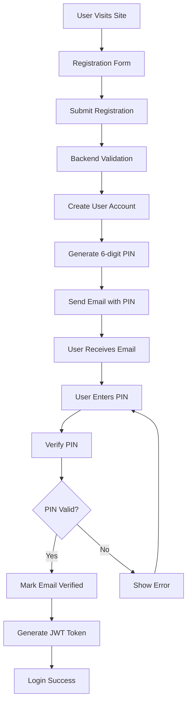
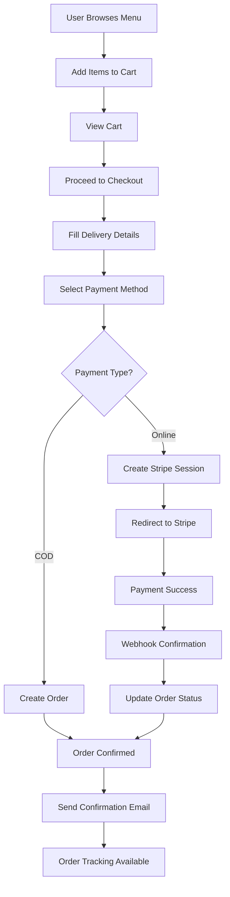
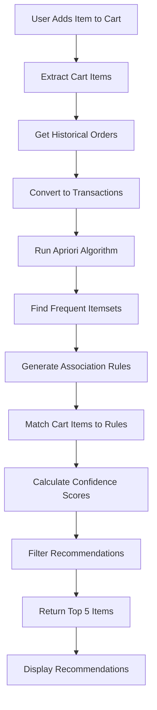

# Trio Order - Working Mechanism & Technical Flow

## Table of Contents

1. [System Architecture Overview](#system-architecture-overview)
2. [Application Flow Diagrams](#application-flow-diagrams)
3. [User Authentication Flow](#user-authentication-flow)
4. [Order Processing Mechanism](#order-processing-mechanism)
5. [Payment Integration Flow](#payment-integration-flow)
6. [Recommendation System Algorithm](#recommendation-system-algorithm)
7. [Admin Panel Operations](#admin-panel-operations)
8. [Database Operations](#database-operations)
9. [Real-time Updates](#real-time-updates)
10. [Error Handling & Recovery](#error-handling--recovery)

## System Architecture Overview

### High-Level Architecture

```
┌─────────────────────────────────────────────────────────────────┐
│                        TRIO ORDER SYSTEM                        │
├─────────────────────────────────────────────────────────────────┤
│  Frontend (React)     │  Admin Panel (React)  │  Backend (Express) │
│  Port: 5173          │  Port: 5174          │  Port: 4000        │
│  Customer Portal      │  Management Panel     │  API Server        │
└─────────────────────────────────────────────────────────────────┘
                                │
                                ▼
┌─────────────────────────────────────────────────────────────────┐
│                    EXTERNAL SERVICES                           │
├─────────────────────────────────────────────────────────────────┤
│  MongoDB Atlas  │  Stripe API  │  Gmail SMTP  │  File Storage    │
│  Database       │  Payments    │  Email       │  Uploads         │
└─────────────────────────────────────────────────────────────────┘
```

### Component Interaction Flow

```
User Request → Frontend → Backend API → Database
     ↓              ↓         ↓           ↓
   Response ← Frontend ← Backend API ← Database
```

## Application Flow Diagrams

### 1. User Registration & Authentication Flow



### 2. Order Processing Flow



### 3. Recommendation System Flow



## User Authentication Flow

### 1. Registration Process

```javascript
// Frontend: Registration Form Submission
const handleRegister = async (userData) => {
  const response = await axios.post("/api/user/register", userData);
  if (response.data.success) {
    navigate("/verify-email");
  }
};

// Backend: User Registration
export const registerUser = async (req, res) => {
  const { username, email, password } = req.body;

  // 1. Validate input data
  if (!username || !email || !password) {
    return res.status(400).json({ message: "All fields required" });
  }

  // 2. Check if user already exists
  const existingUser = await User.findOne({ email });
  if (existingUser) {
    return res.status(400).json({ message: "User already exists" });
  }

  // 3. Hash password
  const saltRounds = 10;
  const hashedPassword = await bcrypt.hash(password, saltRounds);

  // 4. Generate verification PIN
  const verificationPin = Math.floor(
    100000 + Math.random() * 900000
  ).toString();
  const verificationPinExpires = new Date(Date.now() + 15 * 60 * 1000); // 15 minutes

  // 5. Create user account
  const user = new User({
    username,
    email,
    password: hashedPassword,
    verificationPin,
    verificationPinExpires,
    isVerified: false,
  });

  await user.save();

  // 6. Send verification email
  await sendVerificationEmail(email, verificationPin);

  res.status(201).json({
    success: true,
    message: "Verification email sent",
  });
};
```

### 2. Email Verification Process

```javascript
// Backend: Email Verification
export const verifyEmail = async (req, res) => {
  const { email, pin } = req.body;

  // 1. Find user by email
  const user = await User.findOne({ email });
  if (!user) {
    return res.status(404).json({ message: "User not found" });
  }

  // 2. Check if PIN matches
  if (user.verificationPin !== pin) {
    return res.status(400).json({ message: "Invalid PIN" });
  }

  // 3. Check if PIN is expired
  if (user.verificationPinExpires < new Date()) {
    return res.status(400).json({ message: "PIN expired" });
  }

  // 4. Mark email as verified
  user.isVerified = true;
  user.verificationPin = undefined;
  user.verificationPinExpires = undefined;
  await user.save();

  // 5. Generate JWT token
  const token = jwt.sign(
    { userId: user._id, email: user.email },
    process.env.JWT_SECRET,
    { expiresIn: "7d" }
  );

  res.json({
    success: true,
    token,
    user: {
      id: user._id,
      username: user.username,
      email: user.email,
    },
  });
};
```

### 3. Login Process

```javascript
// Backend: User Login
export const loginUser = async (req, res) => {
  const { email, password } = req.body;

  // 1. Find user by email
  const user = await User.findOne({ email });
  if (!user) {
    return res.status(401).json({ message: "Invalid credentials" });
  }

  // 2. Check if email is verified
  if (!user.isVerified) {
    return res.status(401).json({
      message: "Please verify your email first",
      redirectTo: "/verify-email",
    });
  }

  // 3. Verify password
  const isPasswordValid = await bcrypt.compare(password, user.password);
  if (!isPasswordValid) {
    return res.status(401).json({ message: "Invalid credentials" });
  }

  // 4. Generate JWT token
  const token = jwt.sign(
    { userId: user._id, email: user.email },
    process.env.JWT_SECRET,
    { expiresIn: "7d" }
  );

  res.json({
    success: true,
    token,
    user: {
      id: user._id,
      username: user.username,
      email: user.email,
    },
  });
};
```

## Order Processing Mechanism

### 1. Cart Management

```javascript
// Frontend: Cart Context
const CartContext = createContext();

export const CartProvider = ({ children }) => {
  const [cartItems, setCartItems] = useState([]);
  const [totalAmount, setTotalAmount] = useState(0);

  const addToCart = async (item) => {
    try {
      const response = await axios.post(
        "/api/cart/add",
        {
          itemId: item._id,
          quantity: 1,
        },
        { headers: authHeaders }
      );

      if (response.data.success) {
        setCartItems(response.data.cart.items);
        setTotalAmount(response.data.cart.totalAmount);
      }
    } catch (error) {
      console.error("Error adding to cart:", error);
    }
  };

  const updateQuantity = async (itemId, quantity) => {
    try {
      const response = await axios.put(
        "/api/cart/update",
        {
          itemId,
          quantity,
        },
        { headers: authHeaders }
      );

      if (response.data.success) {
        setCartItems(response.data.cart.items);
        setTotalAmount(response.data.cart.totalAmount);
      }
    } catch (error) {
      console.error("Error updating cart:", error);
    }
  };

  return (
    <CartContext.Provider
      value={{
        cartItems,
        totalAmount,
        addToCart,
        updateQuantity,
        clearCart: () => {
          setCartItems([]);
          setTotalAmount(0);
        },
      }}
    >
      {children}
    </CartContext.Provider>
  );
};
```

### 2. Order Creation Process

```javascript
// Backend: Order Creation
export const createOrder = async (req, res) => {
  try {
    const {
      firstName,
      lastName,
      phone,
      email,
      address,
      city,
      zipCode,
      paymentMethod,
      subtotal,
      tax,
      total,
      items,
    } = req.body;

    // 1. Validate required fields
    if (
      !firstName ||
      !lastName ||
      !phone ||
      !email ||
      !address ||
      !city ||
      !zipCode
    ) {
      return res.status(400).json({ message: "All fields are required" });
    }

    // 2. Prepare order items
    const orderItems = items.map((item) => ({
      item: {
        name: item.name,
        price: item.price,
        imageUrl: item.imageUrl,
      },
      quantity: item.quantity,
    }));

    // 3. Calculate shipping (free for orders above ₹500)
    const shippingCost = subtotal >= 500 ? 0 : 50;

    let newOrder;

    if (paymentMethod === "online") {
      // 4. Create Stripe checkout session
      const session = await stripe.checkout.sessions.create({
        payment_method_types: ["card"],
        mode: "payment",
        line_items: orderItems.map((item) => ({
          price_data: {
            currency: "inr",
            product_data: { name: item.item.name },
            unit_amount: Math.round(item.item.price * 100),
          },
          quantity: item.quantity,
        })),
        customer_email: email,
        success_url: `${process.env.FRONTEND_URL}/myorder/verify?success=true&session_id={CHECKOUT_SESSION_ID}`,
        cancel_url: `${process.env.FRONTEND_URL}/checkout?payment_status=cancel`,
        metadata: { firstName, lastName, email, phone },
      });

      // 5. Create order with pending payment
      newOrder = new Order({
        user: req.user._id,
        firstName,
        lastName,
        phone,
        email,
        address,
        city,
        zipCode,
        paymentMethod,
        subtotal,
        tax,
        total: total + shippingCost,
        shipping: shippingCost,
        items: orderItems,
        paymentIntentId: session.payment_intent,
        sessionId: session.id,
        paymentStatus: "pending",
        status: "pending",
      });

      await newOrder.save();

      return res.status(201).json({
        order: newOrder,
        checkouturl: session.url,
      });
    } else {
      // 6. Create COD order
      newOrder = new Order({
        user: req.user._id,
        firstName,
        lastName,
        phone,
        email,
        address,
        city,
        zipCode,
        paymentMethod,
        subtotal,
        tax,
        total: total + shippingCost,
        shipping: shippingCost,
        items: orderItems,
        paymentStatus: "succeeded",
        status: "pending",
      });

      await newOrder.save();

      return res.status(201).json({
        order: newOrder,
        checkouturl: null,
      });
    }
  } catch (error) {
    console.error("CreateOrder error:", error);
    res.status(500).json({ message: "Server error", error: error.message });
  }
};
```

### 3. Order Status Updates

```javascript
// Backend: Update Order Status
export const updateOrderStatus = async (req, res) => {
  try {
    const { orderId } = req.params;
    const { status } = req.body;

    // 1. Find order
    const order = await Order.findById(orderId);
    if (!order) {
      return res.status(404).json({ message: "Order not found" });
    }

    // 2. Validate status transition
    const validStatuses = [
      "pending",
      "processing",
      "preparing",
      "outForDelivery",
      "delivered",
      "cancelled",
    ];
    if (!validStatuses.includes(status)) {
      return res.status(400).json({ message: "Invalid status" });
    }

    // 3. Update order status
    order.status = status;

    // 4. Set delivery timestamp if delivered
    if (status === "delivered") {
      order.deliveredAt = new Date();
    }

    await order.save();

    // 5. Send notification to user
    await sendOrderStatusNotification(order.user, order._id, status);

    res.json({
      success: true,
      message: "Order status updated",
      order,
    });
  } catch (error) {
    console.error("UpdateOrderStatus error:", error);
    res.status(500).json({ message: "Server error", error: error.message });
  }
};
```

## Payment Integration Flow

### 1. Stripe Integration

```javascript
// Backend: Stripe Configuration
import Stripe from "stripe";
const stripe = new Stripe(process.env.STRIPE_SECRET_KEY);

// Frontend: Stripe Elements Integration
import { loadStripe } from "@stripe/stripe-js";
import {
  Elements,
  CardElement,
  useStripe,
  useElements,
} from "@stripe/react-stripe-js";

const stripePromise = loadStripe(process.env.VITE_STRIPE_PUBLISHABLE_KEY);

const CheckoutForm = () => {
  const stripe = useStripe();
  const elements = useElements();

  const handleSubmit = async (event) => {
    event.preventDefault();

    if (!stripe || !elements) return;

    const cardElement = elements.getElement(CardElement);

    const { error, paymentMethod } = await stripe.createPaymentMethod({
      type: "card",
      card: cardElement,
    });

    if (error) {
      console.error("Payment error:", error);
    } else {
      // Process payment with backend
      const response = await axios.post("/api/orders/create-payment-intent", {
        amount: totalAmount * 100, // Convert to paise
        paymentMethodId: paymentMethod.id,
      });

      if (response.data.success) {
        // Confirm payment
        const { error: confirmError } = await stripe.confirmCardPayment(
          response.data.clientSecret
        );

        if (confirmError) {
          console.error("Payment confirmation error:", confirmError);
        } else {
          // Payment successful
          navigate("/order-success");
        }
      }
    }
  };

  return (
    <form onSubmit={handleSubmit}>
      <CardElement />
      <button type="submit" disabled={!stripe}>
        Pay ₹{totalAmount}
      </button>
    </form>
  );
};
```

### 2. Payment Verification

```javascript
// Backend: Payment Verification
export const confirmPayment = async (req, res) => {
  try {
    const { sessionId } = req.body;

    // 1. Retrieve Stripe session
    const session = await stripe.checkout.sessions.retrieve(sessionId);

    if (session.payment_status === "paid") {
      // 2. Find order by session ID
      const order = await Order.findOne({ sessionId });
      if (!order) {
        return res.status(404).json({ message: "Order not found" });
      }

      // 3. Update payment status
      order.paymentStatus = "succeeded";
      order.status = "processing";
      await order.save();

      // 4. Clear user's cart
      await Cart.findOneAndUpdate(
        { user: order.user },
        { items: [], totalAmount: 0 }
      );

      // 5. Send confirmation email
      await sendOrderConfirmationEmail(order.email, order);

      res.json({
        success: true,
        message: "Payment confirmed",
        order,
      });
    } else {
      res.status(400).json({ message: "Payment not completed" });
    }
  } catch (error) {
    console.error("ConfirmPayment error:", error);
    res.status(500).json({ message: "Server error", error: error.message });
  }
};
```

## Recommendation System Algorithm

### 1. Apriori Algorithm Implementation

```javascript
// Backend: Apriori Algorithm
export class AprioriAlgorithm {
  constructor(minSupport = 0.05, minConfidence = 0.3) {
    this.minSupport = minSupport;
    this.minConfidence = minConfidence;
  }

  // Find frequent itemsets
  findFrequentItemsets(transactions) {
    const itemCounts = {};
    const totalTransactions = transactions.length;

    // Count item frequencies
    transactions.forEach((transaction) => {
      transaction.forEach((item) => {
        itemCounts[item] = (itemCounts[item] || 0) + 1;
      });
    });

    // Find frequent 1-itemsets
    const frequentItemsets = [];
    Object.keys(itemCounts).forEach((item) => {
      const support = itemCounts[item] / totalTransactions;
      if (support >= this.minSupport) {
        frequentItemsets.push({
          items: [item],
          support: support,
          count: itemCounts[item],
        });
      }
    });

    // Find frequent k-itemsets (k > 1)
    let k = 2;
    let currentFrequentItemsets = frequentItemsets;

    while (currentFrequentItemsets.length > 0) {
      const candidateItemsets = this.generateCandidates(
        currentFrequentItemsets,
        k
      );
      const frequentKItemsets = [];

      candidateItemsets.forEach((candidate) => {
        const count = this.countSupport(candidate.items, transactions);
        const support = count / totalTransactions;

        if (support >= this.minSupport) {
          frequentKItemsets.push({
            items: candidate.items,
            support: support,
            count: count,
          });
        }
      });

      frequentItemsets.push(...frequentKItemsets);
      currentFrequentItemsets = frequentKItemsets;
      k++;
    }

    return frequentItemsets;
  }

  // Generate association rules
  generateRules(frequentItemsets) {
    const rules = [];

    frequentItemsets.forEach((itemset) => {
      if (itemset.items.length > 1) {
        const subsets = this.generateSubsets(itemset.items);

        subsets.forEach((subset) => {
          const consequent = itemset.items.filter(
            (item) => !subset.includes(item)
          );
          if (consequent.length > 0) {
            const antecedentSupport = this.findSupport(
              subset,
              frequentItemsets
            );
            const confidence = itemset.support / antecedentSupport;

            if (confidence >= this.minConfidence) {
              rules.push({
                antecedent: subset,
                consequent: consequent,
                confidence: confidence,
                support: itemset.support,
                lift:
                  confidence / this.findSupport(consequent, frequentItemsets),
              });
            }
          }
        });
      }
    });

    return rules.sort((a, b) => b.confidence - a.confidence);
  }

  // Get recommendations based on cart items
  getRecommendations(cartItems, rules) {
    const recommendations = [];

    rules.forEach((rule) => {
      // Check if cart items match rule antecedent
      const cartItemIds = cartItems.map((item) => item.item._id.toString());
      const antecedentIds = rule.antecedent.map((item) => item._id.toString());

      if (this.isSubset(antecedentIds, cartItemIds)) {
        // Find items not already in cart
        const recommendedItems = rule.consequent.filter(
          (item) => !cartItemIds.includes(item._id.toString())
        );

        recommendedItems.forEach((item) => {
          recommendations.push({
            item: item,
            confidence: rule.confidence,
            basedOn: rule.antecedent,
          });
        });
      }
    });

    return recommendations
      .sort((a, b) => b.confidence - a.confidence)
      .slice(0, 5); // Return top 5 recommendations
  }
}
```

### 2. Recommendation API Endpoint

```javascript
// Backend: Get Recommendations
export const getRecommendations = async (req, res) => {
  try {
    const { cartItems } = req.body;

    if (!cartItems || cartItems.length === 0) {
      // Return popular items if no cart items
      const popularItems = await Item.find().sort({ hearts: -1 }).limit(5);

      return res.json({
        success: true,
        recommendations: popularItems.map((item) => ({
          ...item.toObject(),
          recommendationScore: 0.5,
          basedOn: [],
        })),
        fallback: true,
      });
    }

    // 1. Get historical orders
    const orders = await Order.find({
      status: "delivered",
      "items.0": { $exists: true },
    }).populate("items.item");

    if (orders.length < 3) {
      // Not enough data for recommendations
      const popularItems = await Item.find().sort({ hearts: -1 }).limit(5);

      return res.json({
        success: true,
        recommendations: popularItems.map((item) => ({
          ...item.toObject(),
          recommendationScore: 0.5,
          basedOn: [],
        })),
        fallback: true,
      });
    }

    // 2. Convert orders to transactions
    const transactions = orders.map((order) =>
      order.items.map((item) => item.item._id.toString())
    );

    // 3. Run Apriori algorithm
    const apriori = new AprioriAlgorithm(0.05, 0.3);
    const frequentItemsets = apriori.findFrequentItemsets(transactions);
    const rules = apriori.generateRules(frequentItemsets);

    // 4. Get recommendations
    const recommendations = apriori.getRecommendations(cartItems, rules);

    // 5. Fetch full item details
    const recommendationItems = await Item.find({
      _id: { $in: recommendations.map((rec) => rec.item._id) },
    });

    const formattedRecommendations = recommendations.map((rec) => {
      const item = recommendationItems.find(
        (i) => i._id.toString() === rec.item._id.toString()
      );
      return {
        ...item.toObject(),
        recommendationScore: rec.confidence,
        basedOn: rec.basedOn,
      };
    });

    res.json({
      success: true,
      recommendations: formattedRecommendations,
      fallback: false,
    });
  } catch (error) {
    console.error("GetRecommendations error:", error);
    res.status(500).json({ message: "Server error", error: error.message });
  }
};
```

## Admin Panel Operations

### 1. Admin Authentication

```javascript
// Backend: Admin Registration
export const registerAdmin = async (req, res) => {
  try {
    const { username, email, password } = req.body;

    // 1. Check if admin already exists
    const existingAdmin = await Admin.findOne({ email });
    if (existingAdmin) {
      return res.status(400).json({ message: "Admin already exists" });
    }

    // 2. Hash password
    const hashedPassword = await bcrypt.hash(password, 10);

    // 3. Generate verification PIN
    const verificationPin = Math.floor(
      100000 + Math.random() * 900000
    ).toString();
    const verificationPinExpires = new Date(Date.now() + 15 * 60 * 1000);

    // 4. Create admin account (pending approval)
    const admin = new Admin({
      username,
      email,
      password: hashedPassword,
      verificationPin,
      verificationPinExpires,
      isVerified: false,
      isApproved: false,
    });

    await admin.save();

    // 5. Send verification email
    await sendAdminVerificationEmail(email, verificationPin);

    res.status(201).json({
      success: true,
      message:
        "Admin registration successful. Please verify your email and wait for approval.",
    });
  } catch (error) {
    console.error("RegisterAdmin error:", error);
    res.status(500).json({ message: "Server error", error: error.message });
  }
};
```

### 2. Item Management

```javascript
// Backend: Add New Item
export const addItem = async (req, res) => {
  try {
    const { name, description, price, category } = req.body;
    const imageUrl = req.file ? `/uploads/${req.file.filename}` : "";

    // 1. Validate required fields
    if (!name || !price || !category) {
      return res
        .status(400)
        .json({ message: "Name, price, and category are required" });
    }

    // 2. Create new item
    const item = new Item({
      name,
      description,
      price: parseFloat(price),
      category,
      imageUrl,
      rating: 0,
      hearts: 0,
    });

    await item.save();

    res.status(201).json({
      success: true,
      message: "Item added successfully",
      item,
    });
  } catch (error) {
    console.error("AddItem error:", error);
    res.status(500).json({ message: "Server error", error: error.message });
  }
};

// Backend: Update Item
export const updateItem = async (req, res) => {
  try {
    const { id } = req.params;
    const updateData = req.body;

    // Handle image upload
    if (req.file) {
      updateData.imageUrl = `/uploads/${req.file.filename}`;
    }

    const item = await Item.findByIdAndUpdate(id, updateData, {
      new: true,
      runValidators: true,
    });

    if (!item) {
      return res.status(404).json({ message: "Item not found" });
    }

    res.json({
      success: true,
      message: "Item updated successfully",
      item,
    });
  } catch (error) {
    console.error("UpdateItem error:", error);
    res.status(500).json({ message: "Server error", error: error.message });
  }
};
```

### 3. Order Management Dashboard

```javascript
// Backend: Get Order Statistics
export const getOrderStats = async (req, res) => {
  try {
    const totalOrders = await Order.countDocuments();
    const pendingOrders = await Order.countDocuments({
      status: { $in: ["pending", "processing"] },
    });
    const deliveredOrders = await Order.countDocuments({
      status: "delivered",
    });
    const cancelledOrders = await Order.countDocuments({
      status: "cancelled",
    });

    // Calculate total revenue
    const revenueResult = await Order.aggregate([
      { $match: { paymentStatus: "succeeded" } },
      { $group: { _id: null, totalRevenue: { $sum: "$total" } } },
    ]);

    const totalRevenue =
      revenueResult.length > 0 ? revenueResult[0].totalRevenue : 0;

    // Get recent orders
    const recentOrders = await Order.find()
      .populate("user", "username email")
      .sort({ createdAt: -1 })
      .limit(10);

    res.json({
      success: true,
      stats: {
        totalOrders,
        pendingOrders,
        deliveredOrders,
        cancelledOrders,
        totalRevenue,
      },
      recentOrders,
    });
  } catch (error) {
    console.error("GetOrderStats error:", error);
    res.status(500).json({ message: "Server error", error: error.message });
  }
};
```

## Database Operations

### 1. Database Connection

```javascript
// Backend: Database Configuration
import mongoose from "mongoose";

const connectDB = async () => {
  try {
    const conn = await mongoose.connect(process.env.MONGODB_URI, {
      useNewUrlParser: true,
      useUnifiedTopology: true,
    });

    console.log(`MongoDB Connected: ${conn.connection.host}`);
  } catch (error) {
    console.error("Database connection error:", error);
    process.exit(1);
  }
};

export default connectDB;
```

### 2. Database Indexes

```javascript
// Backend: Database Indexes for Performance
// User Model Indexes
userSchema.index({ email: 1 }, { unique: true });
userSchema.index({ username: 1 }, { unique: true });
userSchema.index({ isVerified: 1 });

// Order Model Indexes
orderSchema.index({ user: 1 });
orderSchema.index({ status: 1 });
orderSchema.index({ paymentStatus: 1 });
orderSchema.index({ createdAt: -1 });
orderSchema.index({ sessionId: 1 });

// Item Model Indexes
itemSchema.index({ category: 1 });
itemSchema.index({ rating: -1 });
itemSchema.index({ hearts: -1 });

// Cart Model Indexes
cartSchema.index({ user: 1 }, { unique: true });
```

### 3. Data Validation

```javascript
// Backend: Mongoose Schema Validation
const userSchema = new mongoose.Schema(
  {
    username: {
      type: String,
      required: [true, "Username is required"],
      unique: true,
      trim: true,
      minlength: [3, "Username must be at least 3 characters"],
      maxlength: [20, "Username cannot exceed 20 characters"],
    },
    email: {
      type: String,
      required: [true, "Email is required"],
      unique: true,
      lowercase: true,
      validate: {
        validator: function (email) {
          return /^[^\s@]+@[^\s@]+\.[^\s@]+$/.test(email);
        },
        message: "Please enter a valid email address",
      },
    },
    password: {
      type: String,
      required: [true, "Password is required"],
      minlength: [8, "Password must be at least 8 characters"],
    },
  },
  {
    timestamps: true,
  }
);
```

## Real-time Updates

### 1. Order Status Notifications

```javascript
// Backend: Send Order Status Notification
export const sendOrderStatusNotification = async (userId, orderId, status) => {
  try {
    const user = await User.findById(userId);
    const order = await Order.findById(orderId);

    if (!user || !order) return;

    const statusMessages = {
      processing: "Your order is being processed",
      preparing: "Your order is being prepared",
      outForDelivery: "Your order is out for delivery",
      delivered: "Your order has been delivered",
      cancelled: "Your order has been cancelled",
    };

    const message = statusMessages[status] || "Order status updated";

    // Create notification
    const notification = new Notification({
      user: userId,
      order: orderId,
      type: "order_status",
      message: message,
      status: status,
    });

    await notification.save();

    // Send email notification
    await sendOrderStatusEmail(user.email, order, status);
  } catch (error) {
    console.error("SendOrderStatusNotification error:", error);
  }
};
```

### 2. Frontend Real-time Updates

```javascript
// Frontend: Order Status Polling
const useOrderStatus = (orderId) => {
  const [orderStatus, setOrderStatus] = useState(null);
  const [loading, setLoading] = useState(true);

  useEffect(() => {
    const pollOrderStatus = async () => {
      try {
        const response = await axios.get(`/api/orders/${orderId}`, {
          headers: authHeaders,
        });

        if (response.data.success) {
          setOrderStatus(response.data.order.status);
        }
      } catch (error) {
        console.error("Error fetching order status:", error);
      } finally {
        setLoading(false);
      }
    };

    // Poll every 30 seconds
    const interval = setInterval(pollOrderStatus, 30000);

    // Initial fetch
    pollOrderStatus();

    return () => clearInterval(interval);
  }, [orderId]);

  return { orderStatus, loading };
};
```

## Error Handling & Recovery

### 1. Global Error Handler

```javascript
// Backend: Global Error Handler
export const errorHandler = (err, req, res, next) => {
  let error = { ...err };
  error.message = err.message;

  // Log error
  console.error(err);

  // Mongoose bad ObjectId
  if (err.name === "CastError") {
    const message = "Resource not found";
    error = { message, statusCode: 404 };
  }

  // Mongoose duplicate key
  if (err.code === 11000) {
    const message = "Duplicate field value entered";
    error = { message, statusCode: 400 };
  }

  // Mongoose validation error
  if (err.name === "ValidationError") {
    const message = Object.values(err.errors)
      .map((val) => val.message)
      .join(", ");
    error = { message, statusCode: 400 };
  }

  res.status(error.statusCode || 500).json({
    success: false,
    error: error.message || "Server Error",
  });
};
```

### 2. Frontend Error Boundary

```javascript
// Frontend: Error Boundary Component
class ErrorBoundary extends React.Component {
  constructor(props) {
    super(props);
    this.state = { hasError: false, error: null };
  }

  static getDerivedStateFromError(error) {
    return { hasError: true, error };
  }

  componentDidCatch(error, errorInfo) {
    console.error("Error caught by boundary:", error, errorInfo);

    // Log error to monitoring service
    if (window.Sentry) {
      window.Sentry.captureException(error);
    }
  }

  render() {
    if (this.state.hasError) {
      return (
        <div className="error-boundary">
          <h2>Something went wrong</h2>
          <p>We're sorry, but something unexpected happened.</p>
          <button onClick={() => window.location.reload()}>Reload Page</button>
        </div>
      );
    }

    return this.props.children;
  }
}
```

### 3. Retry Mechanism

```javascript
// Frontend: API Retry Utility
const retryApiCall = async (apiCall, maxRetries = 3, delay = 1000) => {
  for (let i = 0; i < maxRetries; i++) {
    try {
      return await apiCall();
    } catch (error) {
      if (i === maxRetries - 1) throw error;

      // Wait before retry
      await new Promise((resolve) =>
        setTimeout(resolve, delay * Math.pow(2, i))
      );
    }
  }
};

// Usage
const fetchOrders = () =>
  retryApiCall(
    () => axios.get("/api/orders", { headers: authHeaders }),
    3,
    1000
  );
```

---

**Document Version**: 1.0  
**Last Updated**: January 2025  
**Prepared By**: Development Team  
**Status**: Active
